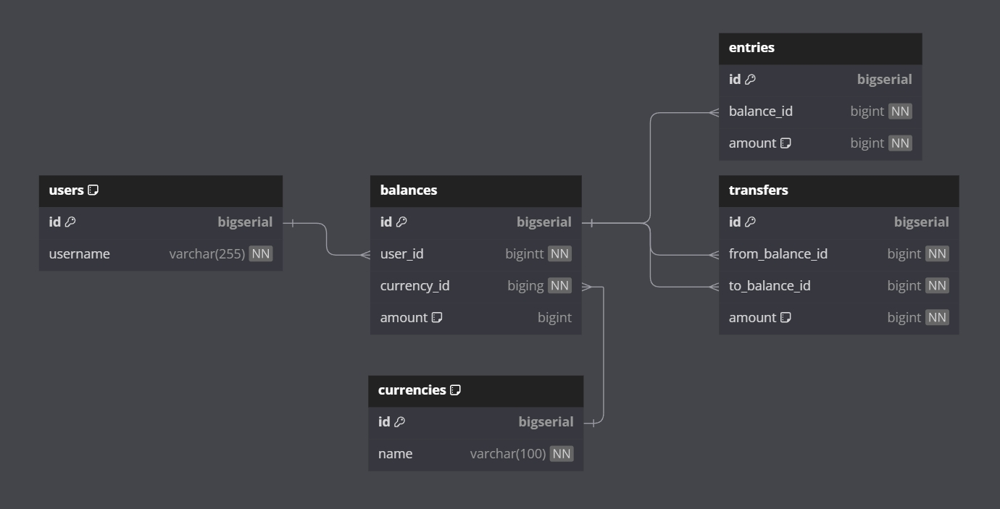

## Balance service with mysql and redis
This app is created for testing purposes of production feature using go instead of one threaded lang.

### Main idea is to test updates in concurrent way and check if it's secure and correct
* avoid lost updates and dirty reads
* handle deadlocks
* secure transfer amount between balances
* secure deposit and withdraw
* add rate limit with redis
* redis queue if needed

### How to run
* install `github.com/golang-migrate/migrate` for migrations  
  `go install -tags 'mysql' github.com/golang-migrate/migrate/v4/cmd/migrate@latest`
* run `make compose` to build images and run containers
* run `make migrate/up` to apply migrations
* run `make test` to run tests

### How to develop
* use dbdiagram.io to visualize db schema from docs
* install sqlc `go install github.com/sqlc-dev/sqlc/cmd/sqlc@latest`
* to generate sqlc code run `make sqlc`
* to generate migration use `migrate create -ext sql -dir db/migrations -seq migration_name`
